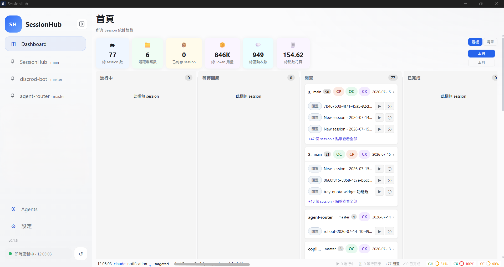
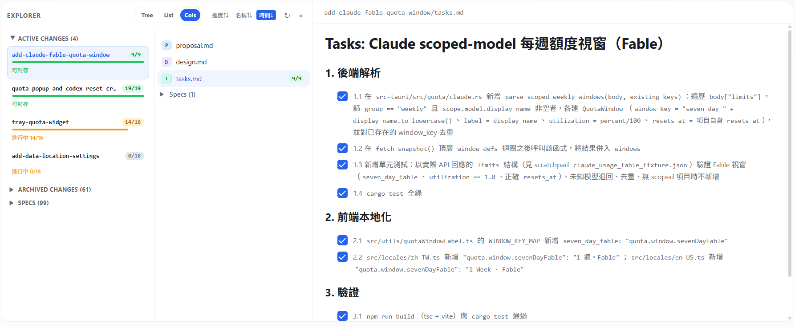
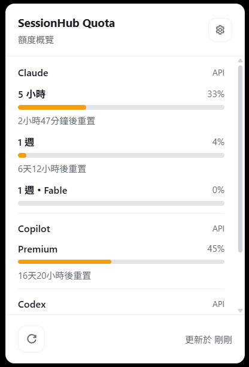
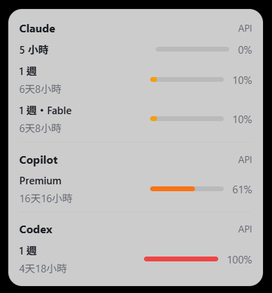

# SessionHub

> Windows 桌面版 AI coding session 工作台：集中管理多個 CLI provider 的 session、quota、Plans & Specs、Agents 與 MCP 設定。

<p>
  <a href="https://github.com/chingleel17/SessionHub/actions/workflows/ci.yml"></a>
  <a href="https://github.com/chingleel17/SessionHub/releases"></a>
  
  
  
  
</p>

SessionHub 適合同時使用 GitHub Copilot CLI、OpenCode、Codex、Claude Code 與 Antigravity 的開發者。它將分散在各工具資料夾中的工作階段集中到單一介面，讓你更快找到工作脈絡、重新進入終端機，並掌握目前的模型額度。

## 特色

- **多 Provider Session 總覽**：掃描五種 AI coding 工具的 session，顯示專案、分支、摘要與更新時間。
- **專案分頁與搜尋**：依工作目錄分組，支援關鍵字、標籤、釘選與排序。
- **Dashboard 與統計**：用看板掌握 session 狀態，查看 Token、互動次數與花費趨勢。
- **Quota 監控**：依 provider 與模型群組查看使用率、剩餘額度與重置時間。
- **Tray 與 Overlay**：縮小至系統匣後快速查看額度，Overlay 提供小型與完整明細兩種檢視。
- **Plans & Specs**：瀏覽 OpenSpec 變更、規格、任務與 `.sisyphus` 計畫資料。
- **Agents 與 MCP 管理**：檢視同步狀態，並以 GUI 管理 Agents、Skills、Commands 與 MCP Server。
- **Hook 與即時更新**：整合 provider hook，session 有變更時自動刷新並提供通知。
- **Session 操作**：一鍵開啟終端、複製重新進入指令、編輯 `plan.md`、加上備註與標籤，或封存 session。
- **繁中／英文介面**：支援繁體中文與 English。

## 支援的 Provider

| Provider | Session 資料來源 | 額度支援 |
| --- | --- | --- |
| GitHub Copilot CLI | `~/.copilot/session-state/` | 狀態與額度整合 |
| OpenCode | session／message／part 資料目錄 | Session 統計 |
| Codex | Codex 資料目錄 | 額度與 reset credits |
| Claude Code | `~/.claude/` | API quota |
| Antigravity（Google Gemini） | `~/.gemini/` brain roots | 本機 language server RPC quota |

各 provider 可在設定頁個別啟用、停用與指定資料根目錄。實際可取得的額度資訊會依 provider 版本、登入狀態與本機環境而異。

## 畫面展示

### Dashboard

集中查看 session 數量、活躍專案、Token 用量、互動次數與花費，並以看板方式瀏覽各專案的 session 狀態。



### Plans & Specs

在專案內瀏覽 OpenSpec 的 active／archived changes、規格與任務進度，支援 Tree、List、Cols 三種檢視模式。



### 系統匣額度面板

SessionHub 縮小至系統匣後，點擊 Tray 圖示即可查看 Claude、Copilot、Codex 等 provider 的額度使用率、重置時間與更新狀態。



### 額度 Overlay

Overlay 提供兩種尺寸：小型版本適合快速確認，完整版本依 provider 分組顯示額度視窗、進度條與重置時間。




## 安裝

### 使用安裝檔

1. 前往 [Releases](../../releases) 下載最新的 `.msi` 或 `-setup.exe`。
2. 執行安裝檔並依照安裝精靈完成安裝。
3. 從開始選單或桌面捷徑開啟 SessionHub。

### 從原始碼建置

需求：Windows 10／11 x64、Rust stable、Node.js 22+、Bun，以及至少一個支援的 AI coding 工具。

```bash
bun install
bun run tauri dev
```

建立安裝檔：

```bash
bun run tauri build
```

輸出位於 `src-tauri/target/release/bundle/`。

## 快速開始

1. 開啟「設定」，啟用要管理的 provider 並確認資料根目錄。
2. 設定 PowerShell／pwsh 路徑；需要時設定外部編輯器。
3. 依需求啟用 quota、通知、Tray 與 hook 整合。
4. 回到 Dashboard，從專案分頁搜尋或開啟 session。
5. 點擊 Tray 圖示，隨時查看額度面板；Overlay 可切換快速與完整檢視。

## 資料與隱私

SessionHub 主要讀取本機 provider 資料，設定與備註儲存在 `%APPDATA%\SessionHub\`。除 provider 本身需要的額度查詢外，不會將 session 內容上傳至 SessionHub 的自有服務；本專案目前沒有自有雲端後端。

| 資料 | 路徑 |
| --- | --- |
| 應用程式設定 | `%APPDATA%\SessionHub\settings.json` |
| 備註、標籤與快取 | `%APPDATA%\SessionHub\metadata.db` |
| GitHub Copilot CLI Sessions | `~/.copilot/session-state/` |
| Claude Code Sessions | `~/.claude/` |
| Antigravity Sessions | `~/.gemini/` |

請勿在 Issue、截圖或 PR 中貼出 API key、Access Token、session 內容或其他敏感資訊。

## 技術棧

- 前端：React 19、TypeScript、Vite、React Query
- 桌面框架：Tauri 2
- 後端：Rust
- 儲存：SQLite（rusqlite bundled）
- 即時監控：`notify` filesystem watcher 與 provider hook bridge
- UI：純 CSS、主題 token 與 responsive layout

## 開發與驗證

```bash
# 前端型別檢查與建置
bun run build

# Rust 格式、Lint 與單元測試
cd src-tauri
cargo fmt -- --check
cargo clippy --all-targets --all-features -- -D warnings
cargo test
```

每個 Pull Request 會由 GitHub Actions 執行前端建置、Rust fmt、Clippy、單元測試、依賴漏洞檢查與祕密資料掃描。詳細規則請參考 [CONTRIBUTING.md](CONTRIBUTING.md)。

CI 會自動驗證每個 PR；GitHub Copilot review 可在 repository 的設定中啟用，並會讀取 [.github/copilot-instructions.md](.github/copilot-instructions.md) 執行風險導向的程式碼審查。AI 審查只提供建議，最終仍由維護者決定是否合併。

## 貢獻與回報問題

歡迎技術交流、錯誤回報與功能建議：

- Bug 或功能建議：使用 GitHub [Issues](../../issues/new/choose)。
- 程式碼變更：請先閱讀 [CONTRIBUTING.md](CONTRIBUTING.md)，再建立 Pull Request。
- 安全漏洞：請依 [SECURITY.md](SECURITY.md) 的方式私下回報，不要直接公開在 Issue。

## 授權

本專案以 [MIT License](LICENSE) 授權。第三方 provider、CLI 與圖示資源仍受其各自授權條款約束。

## 變更紀錄

請參考 [CHANGELOG.md](CHANGELOG.md)。
